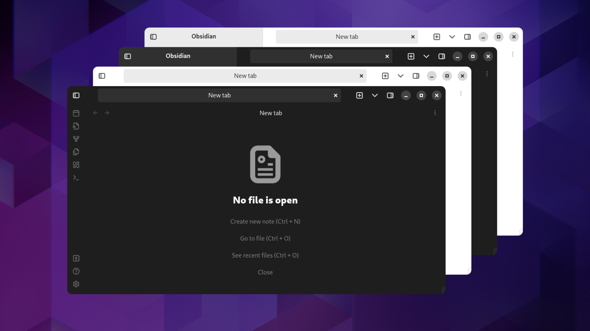

# Obsidian Adwaita Theme

This is an [Obisidian](https://obsidian.md/) theme in the style of [Gnome](https://www.gnome.org/) [Adwaita](https://en.wikipedia.org/wiki/Adwaita_(design_language)). The goal of this project is to make Obsidian look more native on Gnome Desktop Environments like on [Ubuntu](https://ubuntu.com/) or [Fedora](https://getfedora.org/). 

## Features 

### Window Buttons

### Tabs

### Icons

### Dark and Light Theme
Change under `Settings > Options > Appearance > Base color scheme`.

### Colors

### Font
This theme uses the system font.

### Style Settings Plugin Support
For customization see [Style Settings](#style-settings).

### TBD Rounded Window Corners
As a workaround use the [Rounded Window Corners](https://extensions.gnome.org/extension/5237/rounded-window-corners/) Gnome Extension.

## Installation

### Obsidian Community Theme Store
1. In Obsidian go to `Settings >  Options > Appearance > Themes > Manage` search for `Adwaita`
2. Click `Install and use`
3. Optionally install the [Obsidian Style Settings Plugin](https://github.com/mgmeyers/obsidian-style-settings) for customization. Adjust under `Settings > Community Plugins > Style Settings > Adwaita`

### Automatic
1. Set `OBSIDIAN_HOME` environment variable to your vault path
2. run `make install`
3. In Obsidian go to `Settings > Options > Appearance > Themes` and select the `Adwaita` theme
4. Optionally install the [Obsidian Style Settings Plugin](https://github.com/mgmeyers/obsidian-style-settings) for customization. Adjust under `Settings > Community Plugins > Style Settings > Adwaita`

### Manual

1. create a `.obsidian/themes/Adwaita` directory in your Obsidian vault
2. Copy `theme.css` and `manifest.json` to the created `Adwaita` folder
3. In Obsidian go to `Settings > Options > Appearance > Themes` and select the `Adwaita` theme
4. Optionally install the [Obsidian Style Settings Plugin](https://github.com/mgmeyers/obsidian-style-settings) for customization. Adjust under `Settings > Community Plugins > Style Settings > Adwaita`

## Build

- Install [sassc](https://github.com/sass/sassc)
- Run `make`

## Style Settings
Requires the [Obsidian Style Settings Plugin](https://github.com/mgmeyers/obsidian-style-settings).
Adjust under `Settings > Community Plugins > Style Settings > Adwaita`.

## Contribution
Feel free to create Issues and Pull Requests.
